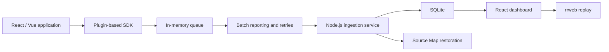

# Frontend Monitoring System Design

## 1. Goal

Build a resume-ready frontend monitoring system for React and Vue applications. The project provides a lightweight browser SDK, a Node.js ingestion service, a React dashboard, replay support, Source Map stack restoration, local development commands, and Docker Compose startup.

The first version focuses on a complete collection-analysis-reporting-reproduction workflow. Authentication, organizations, alert rules, and production deployment automation are outside the initial scope.

## 2. Repository Layout

Use a pnpm workspace monorepo:

```text
packages/sdk              Browser monitoring SDK built from TypeScript to JavaScript
apps/server               Node.js API service with SQLite persistence
apps/dashboard            React, Vite, and TypeScript monitoring dashboard
examples/react-demo       React integration demo and error trigger page
examples/vue-demo         Vue integration demo and error trigger page
```

Local development supports a single `pnpm dev` command. Docker Compose starts the server, dashboard, and demos with persistent volumes for the SQLite database and uploaded Source Map files.

## 3. Architecture

The browser SDK captures telemetry and pushes normalized event envelopes into an in-memory reporting queue. The reporting plugin submits event batches to the Node.js service. The service persists events in SQLite, restores supported stack frames with uploaded Source Maps, and exposes query APIs consumed by the dashboard.



## 4. SDK Design

### 4.1 Public API

The SDK exposes a small lifecycle-oriented API:

```ts
const monitor = createMonitor({
  appId,
  endpoint,
  environment,
  release,
  plugins,
  privacy
})

monitor.start()
monitor.flush()
monitor.stop()
```

All plugins are optional and can be enabled on demand.

### 4.2 Event Envelope

Plugins normalize captured data into a common event envelope:

```ts
interface MonitorEvent<TPayload = unknown> {
  id: string
  appId: string
  sessionId: string
  type: string
  timestamp: number
  pageUrl: string
  release: string
  payload: TPayload
}
```

### 4.3 Global EventBus

The SDK uses one global `EventBus` instance to decouple every module. The core creates the bus, loads plugins, and controls lifecycle. Plugins communicate only by publishing and subscribing to typed bus events. They must not call one another directly.

Core events:

| Event | Publisher | Subscriber | Purpose |
| --- | --- | --- | --- |
| `event:capture` | Error, performance, behavior, replay plugins | Reporter plugin | Enqueue a normalized event |
| `report:flush` | Timer, page lifecycle handler, public `flush()` | Reporter plugin | Send queued events |
| `report:success` | Reporter plugin | Debug and extension plugins | Observe successful delivery |
| `report:failure` | Reporter plugin | Retry and debug handlers | Observe failed delivery |
| `lifecycle:start` | SDK core | All plugins | Register listeners and begin capture |
| `lifecycle:stop` | SDK core | All plugins | Remove listeners and release resources |

The EventBus catches subscriber errors and continues notifying remaining subscribers. The SDK core isolates plugin startup and shutdown failures so one plugin cannot disable other monitoring capabilities.

### 4.4 Plugins

| Plugin | Responsibility |
| --- | --- |
| `ErrorPlugin` | Capture runtime errors, unhandled Promise rejections, and resource load failures. Generate fingerprints from error category, message, and source position to suppress duplicate reports. |
| `PerformancePlugin` | Capture Web Vitals, long tasks, and resource timing entries. |
| `BehaviorPlugin` | Record clicks, route changes, XHR requests, and Fetch requests. Sanitize captured URLs and request metadata. |
| `ReplayPlugin` | Record rrweb incremental snapshots by session and emit replay batches. Mask text input, block password values, and ignore sensitive DOM nodes. |
| `ReporterPlugin` | Queue events, flush by interval and batch threshold, retry failed batches with bounded exponential backoff, and choose transport by page lifecycle and browser capabilities. |

### 4.5 Reporting and Loop Prevention

Normal background delivery uses Fetch. During page exit, the reporter prefers Beacon. If neither route is available for a small payload, it falls back to Image transport.

SDK-generated requests contain an internal marker. The behavior plugin checks this marker before recording Fetch or XHR activity, preventing recursive self-reporting.

### 4.6 Privacy Defaults

Replay capture is private by default:

- Password inputs are fully blocked.
- Other text inputs are masked.
- Sensitive DOM nodes can be ignored through configuration.
- Request capture stores sanitized metadata rather than request bodies.

## 5. Server Design

`apps/server` uses Node.js and TypeScript. SQLite stores events and query-oriented projections. Uploaded Source Map files are stored in a mounted server directory; SQLite stores their metadata.

### 5.1 API Surface

| API | Purpose |
| --- | --- |
| `POST /api/events/batch` | Validate and persist SDK event batches |
| `GET /api/overview` | Return error count, session count, and performance summaries |
| `GET /api/errors` | Return paginated, fingerprint-grouped errors |
| `GET /api/errors/:id` | Return error detail and restored stack information |
| `GET /api/performance` | Return Web Vitals, long task, and resource timing trends |
| `GET /api/sessions` | Return replay-capable sessions |
| `GET /api/sessions/:id/replay` | Return rrweb events for one session |
| `POST /api/sourcemaps` | Upload a Source Map keyed by `appId`, `release`, and generated file |

### 5.2 Source Map Restoration

When a JavaScript error arrives, the server matches stack frames against uploaded maps using `appId`, `release`, and generated script file. Successful matches produce restored source locations. Missing or invalid maps do not block ingestion; the raw stack remains available.

### 5.3 Persistence

The initial schema separates general telemetry, grouped errors, replay events, and Source Map metadata. Query APIs use indexed fields such as `appId`, `type`, `timestamp`, `sessionId`, `release`, and error fingerprint.

## 6. Dashboard Design

`apps/dashboard` uses React, Vite, and TypeScript. It is a demonstration dashboard rather than a multi-tenant administration platform.

Pages:

| Page | Content |
| --- | --- |
| Overview | Summary cards for errors, sessions, and performance health |
| Errors | Paginated grouped errors with count, latest occurrence, and detail view |
| Performance | Web Vitals trends, long tasks, and slow resource timing results |
| Sessions | Replay-capable session list |
| Replay | rrweb player for one session |

The dashboard presents real persisted data from the server. Demo applications include explicit actions that trigger representative errors, requests, navigation, and replay events.

## 7. Delivery Phases

### Phase 1: Runnable Vertical Workflow

1. Create the workspace and shared TypeScript setup.
2. Build the typed EventBus and SDK lifecycle.
3. Add collection plugins and queue-based reporting.
4. Implement event ingestion and SQLite persistence.
5. Add dashboard query pages and rrweb replay.
6. Add React and Vue demo applications.

### Phase 2: Presentation Enhancements

1. Add Source Map upload and stack restoration.
2. Add dashboard trends and polish.
3. Add Docker Compose startup and persistent volumes.
4. Complete README setup and demonstration steps.

## 8. Error Handling

- A failing SDK plugin does not interrupt unrelated plugins.
- A failing EventBus subscriber does not prevent later subscribers from running.
- Reporter retries are bounded to avoid unending background work.
- Invalid server payloads return validation errors without partial writes.
- Source Map failures preserve raw stack traces and do not block event ingestion.
- Dashboard pages expose empty and error states for failed queries.

## 9. Testing Strategy

Use test-driven development for implementation.

SDK unit tests cover:

- EventBus subscription, unsubscription, and subscriber isolation.
- Error fingerprints and duplicate suppression.
- Input masking and sensitive field blocking.
- Internal request marker handling.
- Queue threshold flushing, retries, and transport fallback.

Server unit and integration tests cover:

- Batch validation and transactional persistence.
- Error grouping and pagination.
- Source Map upload and stack restoration fallback.
- Overview and performance aggregation.
- Replay session retrieval.

End-to-end tests cover:

- Capturing demo application activity and persisting it to SQLite.
- Reading persisted monitoring results through dashboard APIs.
- Loading rrweb events for replay.

## 10. Out of Scope

The initial version does not include login, organization management, alert rules, notification delivery, remote production deployment, or distributed storage. These can be added later without changing the EventBus-based SDK contract.
